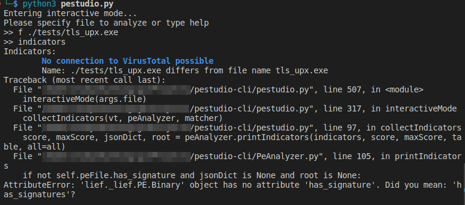
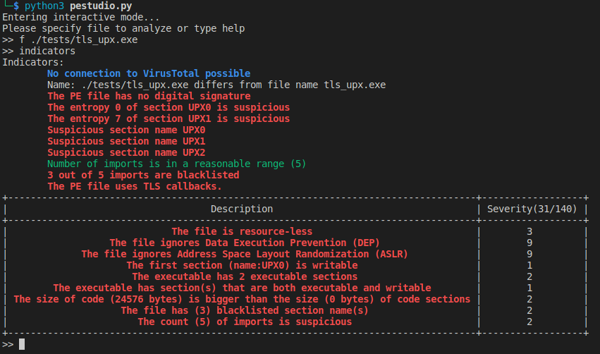
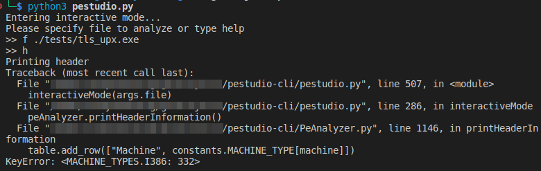
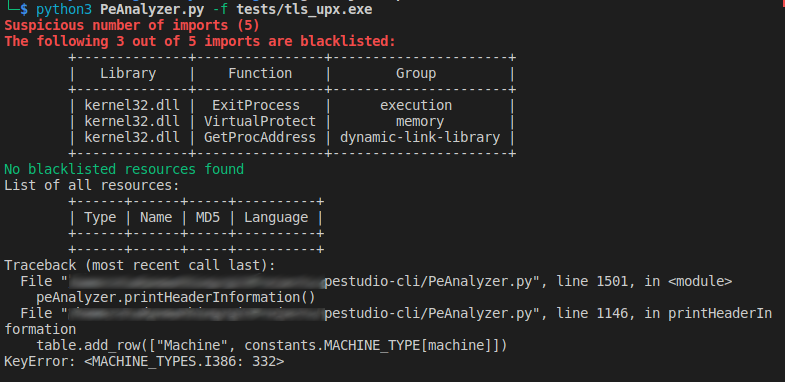
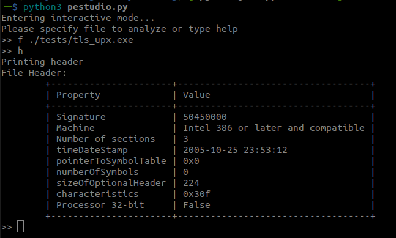
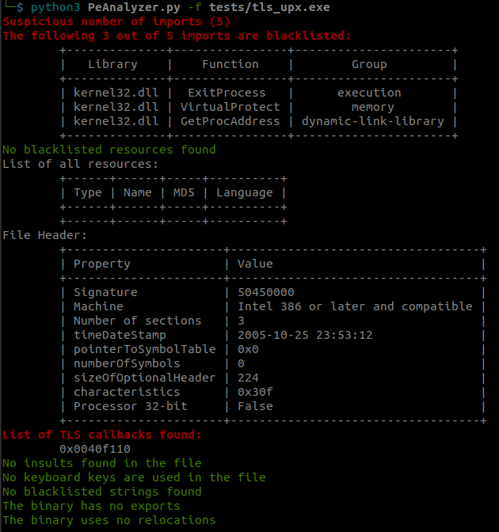
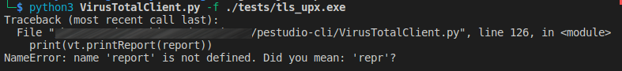
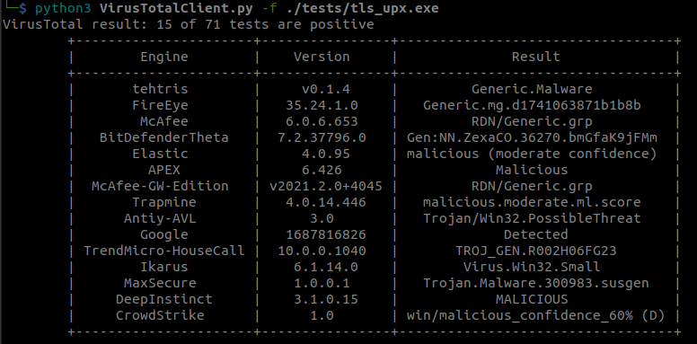
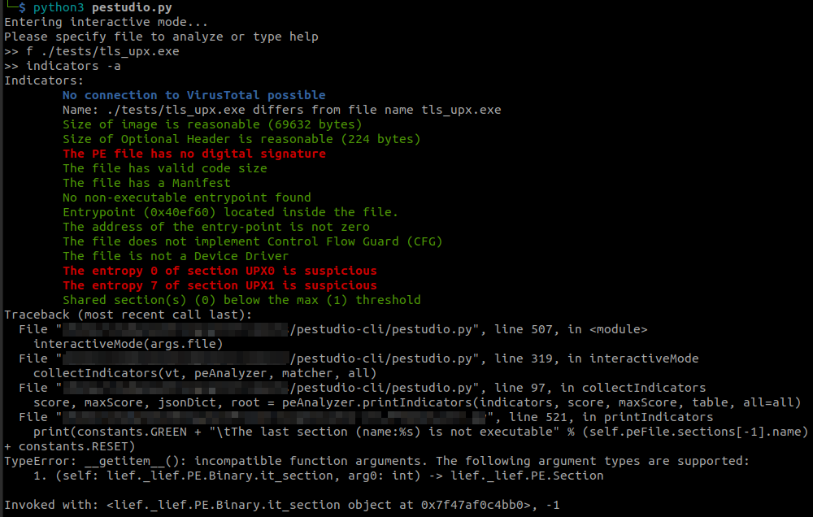
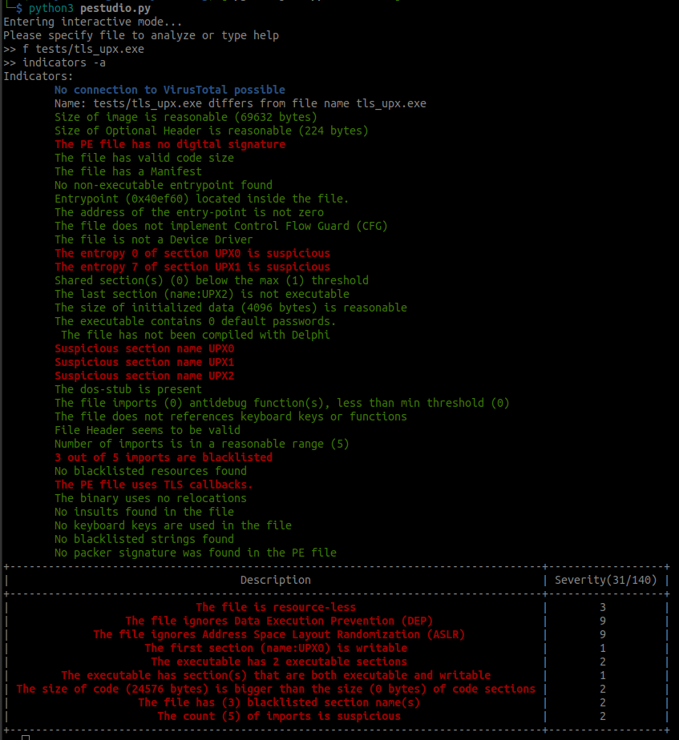

- [Identify errors and correction results](#identify-errors-and-correction-results)
  - [no attribute 'has\_signature'](#no-attribute-has_signature)
  - [KeyError: \<MACHINE\_TYPES.I386: 332\>](#keyerror-machine_typesi386-332)
  - [NameError: name 'report' is not defined](#nameerror-name-report-is-not-defined)
  - [TypeError: __getitem__(): incompatible function arguments.](#typeerror-getitem-incompatible-function-arguments)
- [Hole detection feature](#hole-detection-feature)
  - [Theories](#theories)

# Identify errors and correction results

## no attribute 'has_signature'

 Error related to new `lief` library. It happends when running pestudio with `indicators` function

 

  Correction: Change method `has_signature` to `has_signatures`. Here is the result:

 

## KeyError: <MACHINE_TYPES.I386: 332>

Errors: These errors were also mentioned in `Pestudio project` - tab `Issues` and the author suggested solutions: Change line 1146: `machine` --> `machine.value`. or use old version of LIEF library. Here we use the first suggested solution.

Correction results:

## NameError: name 'report' is not defined

Error when run `VirusTotalClient.py`. Note that before running, you need to put an API key from virustotal in a file name: `VirusTotalApiKey` in the root folder of the project.

Correction: line 126: `print(vt.printReport(report))` --> `print(vt.printReport())`.

Result:

## TypeError: __getitem__(): incompatible function arguments.

Error when run `pestudio.py` with `indicators -a`: Not support negative index.

Corrections: change the index `-1` to `len(...)-1`.

Result:

# Hole detection feature

This part is about implementing a holde detection feature.

## Theories

<https://ivanlef0u.fr/repo/madchat/vxdevl/papers/winsys/pefile/pefile.htm>

<https://i.stack.imgur.com/0DdKh.png>

<https://stackoverflow.com/questions/12416054/pe-file-format-what-is-between-the-section-table-and-the-first-section>

<http://www.openrce.org/reference_library/files/reference/PE%20Format.pdf>