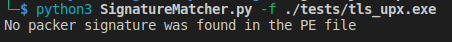

- [Identify rrors and orrection results](#identify-rrors-and-orrection-results)
  - [1](#anchor-1)
  - [2](#anchor-2)

# Identify rrors and orrection results

## 1

 Error related to new lief. It happends when running pestudio with `indicators` function

 

  Correction: Change method `has_signature` to `has_signatures`. Here is the result:

 

## 2

Errors: This error is also mentioned in Pestudio project - Header Issues and the author also suggested solutions: Change line 1146: machine --> machine.value. or use old version of LIEF library. Here we use the first suggested solution.

Correction results:

