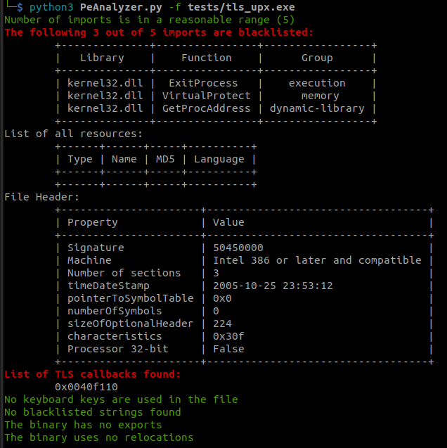
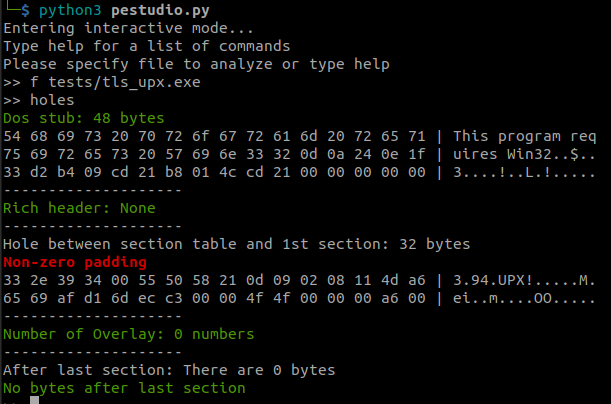

- [Identify errors and correction results](#identify-errors-and-correction-results)
	- [no attribute 'has\_signature'](#no-attribute-has_signature)
	- [KeyError: \<MACHINE\_TYPES.I386: 332\>](#keyerror-machine_typesi386-332)
	- [NameError: name 'report' is not defined](#nameerror-name-report-is-not-defined)
	- [TypeError: __getitem__(): incompatible function arguments.](#typeerror-getitem-incompatible-function-arguments)
- [Update xml folder](#update-xml-folder)
- [Hole detection feature](#hole-detection-feature)
	- [Theories](#theories)
	- [References](#references)

# Identify errors and correction results

## no attribute 'has_signature'

 Error related to new `lief` library. It happends when running pestudio with `indicators` function

 

  Correction: Change method `has_signature` to `has_signatures`. Here is the result:

 

## KeyError: <MACHINE_TYPES.I386: 332>

Errors: These errors were also mentioned in `Pestudio project` - tab `Issues` and the author suggested solutions: Change line 1146: `machine` --> `machine.value`. or use old version of LIEF library. Here we use the first suggested solution.

Correction results:

## NameError: name 'report' is not defined

Error when run `VirusTotalClient.py`. Note that before running, you need to put an API key from virustotal in a file name: `VirusTotalApiKey` in the root folder of the project.

Correction: line 126: `print(vt.printReport(report))` --> `print(vt.printReport())`.

Result:

## TypeError: __getitem__(): incompatible function arguments.

Error when run `pestudio.py` with `indicators -a`: Not support negative index.

Corrections: change the index `-1` to `len(...)-1`.

Result:

# Update xml folder

We update the old xml folder with new xml folder. We fixed the file PeAnalyzer.py to be compatible with the new xml folder.

We have to remove many indicators since it does not have the corresponding id in the new xml folder. At least, until now, the file works. Here is the result of running new PeAnalyzer.py

Here is the result of older PeAnalyzer.py

# Hole detection feature

This part is about implementing a holde detection feature.

## Theories

We define the data outside sections as
- the data between the `Section table` and the `First section`
- the data after the last section (`overlay`).
We do not know that if the `certificate`, `Rich Header`, `Dos stub`  can be considered as data outside sections.

Our new features file name `HolesDetection.py`:
- It can be integrated in the interactive mode of `pestudio.py`
- It can calculate and check the size of the `Rich Header`, `Dos stub`, padding between `Section table` and the `first Section`, between `last section` and the end of file.
- It can show the content of the above data like the result of a `hexdump -C` command.

By searching in the internet, there some ideas that the `overlay` offset depends on the `Certificate` but the `Certificate` can be consider as a part of the `overlay`. Hence, for safty, we do not impliment the calculation the size of the `overlay`. But we do implement the calculation of size betweem the `last section` and the `end of file`.

size of data between `Section table` and `first section`
= `first section offset` - `PE signature (PE\0\0) offset`-`File header size (24 bytes)` - `one section table size (40 bytes)`* `number of sections`.

size of data between `last section` and `end of file` = `file size`-`last section offset`-`size of last section`.

Here is the result when running with the test:

## References

A question about the data between the section table and the first setion:

<https://stackoverflow.com/questions/12416054/pe-file-format-what-is-between-the-section-table-and-the-first-section>

Two images visualize the structre of PE file:

<https://i.stack.imgur.com/0DdKh.png>

<http://www.openrce.org/reference_library/files/reference/PE%20Format.pdf>

A page explain some more detail about PE file:

<https://ivanlef0u.fr/repo/madchat/vxdevl/papers/winsys/pefile/pefile.htm>

