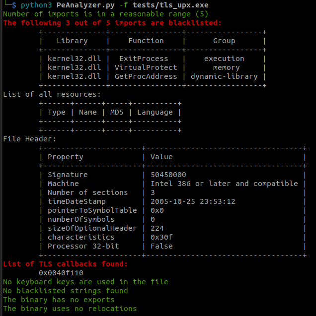

# Update xml folder

We update the old xml folder with new xml folder. We fixed the file PeAnalyzer.py to be compatible with the new xml folder.

We have to remove many indicators since it does not have the corresponding id in the new xml folder. At least, until now, the file works. Here is the result of running new PeAnalyzer.py

Here is the result of older PeAnalyzer.py

